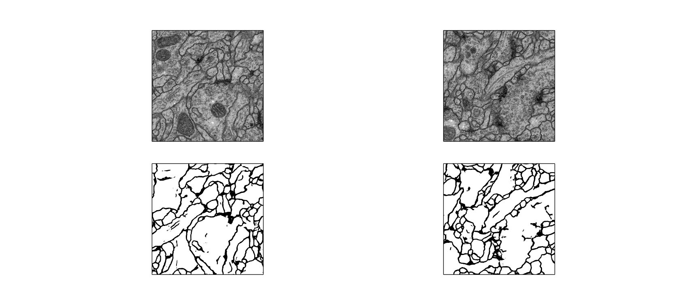

# detail of implement unet 

when u get the code and data

**first** u should run the **split_merge_tif.py**, because the meta data train-volume.tid includes 30 tif image, so u should split it. so the test-volume.tif and train-volume.tif is same.

**second** u should run **data.py** it make data augmentation, i first merge the tarin image and the corresponding groundtruth, so we can make train image and label have the same change,  we save the merge data in diretory named merge
after merge and then make augmentation,u can refer to 
https://blog.keras.io/building-powerful-image-classification-models-using-very-little-data.html, we save augmentated image in diretory named aug_merge
after augmentation we split the merged image to train and label to diretory named in aug_train and aug_label.

**next** u can run **unet.py**. when u finished run unet.py, it will generate **unet.hdf5** and **imgs_mask_test.npy** 

if u want to show the result of unet, u can run **test_predict.py**

**if u use windows, the '/' in the path shoud be replaced with '\\\'**

if u have any question please issue, thank u.

email: silencekxm@gmail.com ponder_1_kxm@163.com

my blog:http://blog.csdn.net/qq_18293213

